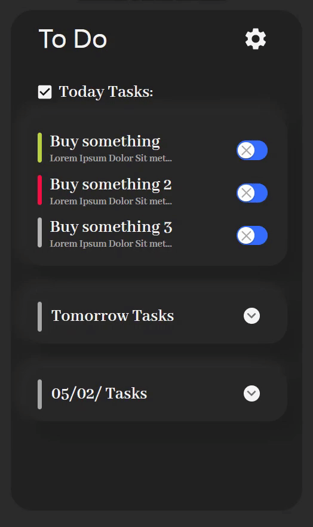

# To Do List

Test app for task management.



## Technologies used

React - https://reactjs.org/  
TypeScript - https://www.typescriptlang.org/  
Webpack - https://webpack.js.org/  
Axios - https://axios-http.com/  
React-Query - https://react-query-v3.tanstack.com/  
Sass/Scss - https://sass-lang.com/  
PostCss - https://postcss.org/ (Only autoprefixer)  
MUI - https://mui.com/  
Cypress - https://www.cypress.io/  
ESLint - https://eslint.org/  
Prettier - https://prettier.io/  

## Project setup

```
npm ci
```

Please note that when running `npm install` you should also provide `--legacy-peer-deps`

## Compiles and hot-reloads for development

```
# start 
npm start
```

## Compiles and minifies for production

```
npm build
```

To analyze bundle, run

```
ANALYZE=true npm run build
```

## Run your ui tests

```
npm run test:ui
```

this will launch webpack dev server on port 3001 and open cypress.
